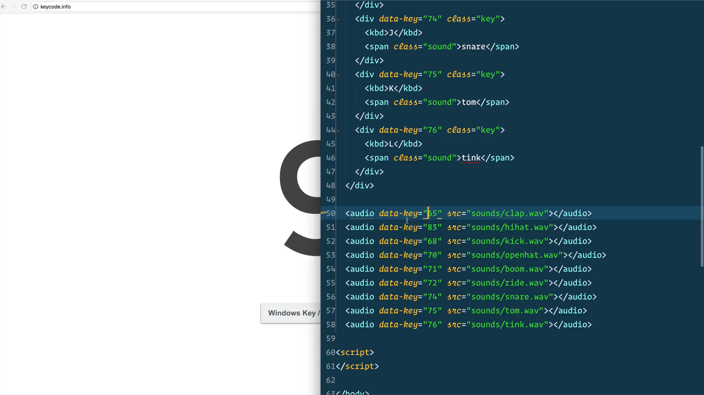

# JavaScript Drum Kit

Here are some screenshots from this super clean and pretty keyboard-based drum kit.

The HTML file uses a data attribute - `data-key` - which will trigger styling and audio playing from a supported keycode.

Here we are defining a playing class that will show a slightly larger button with a colored border.

Here is the secret sauce to make this work. When a supported keycode is pressed, the HTML element will transition to a `.playing` class, and our `<audio>` element for that keycode will play. If a supported keycode is pressed repeatedly, the `<audio>` element will be reset to `0` so that the key can trigger the sound immediately.

Once that transition is complete, our code will remove the `.playing` class.

